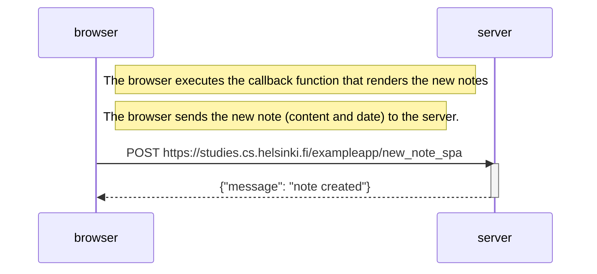

```mermaid
sequenceDiagram
    participant browser
    participant server

    Note right of browser: The browser executes the callback function that renders the new notes
    Note right of browser: The browser sends the new note (content and date) to the server.
    browser->>server: POST https://studies.cs.helsinki.fi/exampleapp/new_note_spa
    activate server
    server-->>browser: {"message": "note created"}
    deactivate server
```
